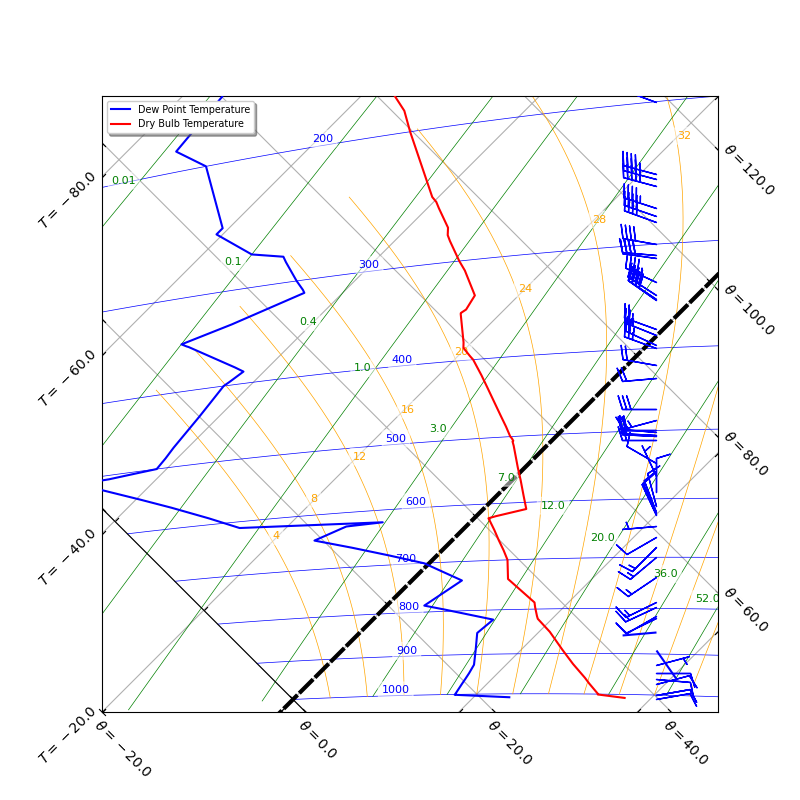
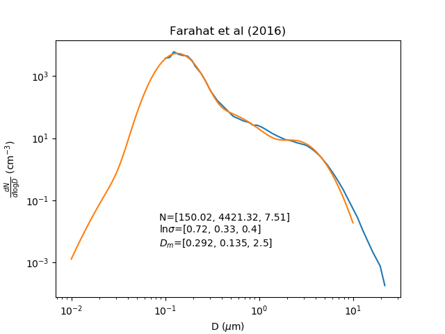

# Will Cloud Seeding work in Qatar?

## What the project is about
We want to understand whether cloud seeding has the potential to increase rainfall in Qatar. This project will use radiosonde data to identify periods where the atmosphere contains sufficient clouds that could be targeted for cloud seeding. You will use a cloud parcel model intiialised with aerosol particles and hygroscopic cloud seeding nuclei to assess whether the hygroscopic nuclei has the potential to increase surface rainfall.

## Code

The code repository for the Bin Microphysics Model is available at [https://github.com/UoM-maul1609/bin-microphysics-model](https://github.com/UoM-maul1609/bin-microphysics-model). This model is written in Fortran and has some associated Python scripts for analysis and plotting.

## Logging in to the virtual machine
Prof. Paul Connolly will start up the VM, give you your username, SSH key (which is a file) and the IP address of the server (VM). To login you need to open `CMD` (on windows), `terminal` if on a mac or Chromebook. You would then type:
   
    ssh -i id_virtual_students.key -X <username>@<IP-address>  

The first time you log in you may need to answer 'yes' to a question about connecting. 

## Downloading the Bin Microphysics Model

Once logged in you will be interacting the VM in the same way as you would a linux server through the terminal. To download the bin microphysics model type:
	
	git clone https://github.com/UoM-maul1609/bin-microphysics-model
	
This should download the code to the folder `bin-microphysics-model`

## Compiling the Bin Microphysics Model

You need to be in the `bin-microphysics-model` folder to compile the code. Type

	cd bin-microphysics-model
	
in the terminal / cmd window to enter the folder.

We need to then tell the computer to build the machine code executable that the computer CPU understands. This can be done by typing:

	make NETCDFLIB=-L/usr/lib/x86_64-linux-gnu/ NETCDFMOD=/usr/include/ FFLAGS='-O2 -w -o' FFLAGS2='-O2 -w -o' FFLAGSOMP='-O2 -w -o'

The `make` command tells the computer to use a file called `Makefile` which is in the `bin-microphysics-model` folder you downloaded. In this file are rules for compiling the code. There are some additional variables that we pass into the Makefile. These are `NETCDFLIB`, `NETCDFMOD`, `FFLAGS`, `FFLAGS2` and `FFLAGSOMP`, which overrides the values they are set to in the Makefile. They need to be altered for our environment. 

## Downloading the Radiosonde data
You will need radiosonde data, which gives the thermodynamic conditions of the atmosphere close to Qatar. The script `download_data_wyoming.py` will automatically download data from the Wyoming database at [https://weather.uwyo.edu/upperair/sounding.html](https://weather.uwyo.edu/upperair/sounding.html). You could download each radiosonde file individually, but that would be very time consuming. The script will download a years worth of data for both 0 and 12 local time. Run the script as follows

	python3 download_data_wyoming.py
	
It will take a while to complete, but will download the data into a folder called `SondeData` in your home folder. You might want to check this folder is empty before you start.

## Reading the Radiosonde data
Once downloaded we can read in all of the radiosonde data using the supplied script `readSondeData.py`. In order to look at the data interactively you will want to run this script from within `ipython3`. If you just pass the script to the python3 interpreter it will read the files and the exit, so all information will be lost. So type the following:

	ipython3
	
Once iPython has started you can run the `readSondeData.py` script as follows:

	run -i readSondeData.py
	
This script will read all of the radiosonde files at ~/SondeData into a python list called `dats`. You can find how many files there are by typing

	len(dats)
	
It probably wont be 2 x number of days in a year because there will be some missing files, which happens when there is a problem with the radiosonde on a particular day. Do not worry about this. 

We generally extract one of these radiosonde ascent files to look at in more detail. Before we do that lets look at some general metrics for the data we have just read in.

## Plotting CAPE vs time

When we read in the radiosondes using `readSondeData.py` it puts the following variables into memory within iPython (you can type `who` or `whos` to see them)
	
	time
	tlcl
	plcl
	cape
	cin
	pw
	
These are: (1) time; (2) temperature of the lifting condensation level; (3) pressure of the lifting condensation level; (4) Convective Available Potential Energy; (5) Convective Inhibition; (6) Precipitable Water. You can then do a plot of CAPE for example as follows

	import matplotlib.pyplot as plt
	plt.ion()
	plt.plot(time,cape,'.-')
	plt.xlabel('time')
	plt.ylabel('CAPE')
	plt.savefig(dataPath.joinpath('cape.png'))

This is just one example, but you could plot other things in a similar way. The data I have downloaded shows that some values of CAPE are 0. These cases are not suitable for analysis. If you would like to download this file you can log in with SSH and then type the following, which will download the file to your local machine.

	get SondeData/cape.png

  

*Figure 1. Plot of the CAPE for the radio sonde data we have downloaded.*

## Plotting a tephigram

From the ipython prompt, after running 

	run -i readSondeData.py

you will have the radiosonde data in memory. Type

	whos
	
to see all data in memory. There should be several variables, but the main ones are `data1` and `dats`. `data1` is the last radiosonde file read in and `dats` is all of them in a list. 

To create a tephigram you can just type

	run -i plotTephigram.py

This will write a file to the location `/tmp/<username>/tephigram.png`

  

*Figure 2. Tephigram of the last radiosonde read in.The radiosonde suggests conditions are right for a shallow convective cloud between 10 degrees C and 2 degrees C*

If you would like to create a different tephigram, the procedure is to set the `data1` variable equal to another radiosonde dataset in the `dats` list, e.g. 
	
	data1=dats[33]
	
and then run the `plotTephigram.py` script again. 

## Aerosol inputs 

We require the background aerosol data. This paper [Farahat et al. 2016](https://digitalcommons.chapman.edu/cgi/viewcontent.cgi?article=1339&context=scs_articles) has an aerosol size distribution measured over Saudi Arabia in Figure 6a. The data have been digitised and put into the script [backgroundAerosol.py](backgroundAerosol.py). This data is $`\frac{dV}{d\ln r}}`$ in the column of air and the model requires $`\frac{dN}{d\ln D}}`$ in a volume of air. We can estimate this quantity by dividing by the volume of the particle assuming it is a sphere, and then dividing by the depth of the column of air that "most" of the aerosol are within. 

The result is shown in Figure 3 along with lognormal fit parameters that the model can use. 

  

*Figure 3. Background aerosol assumptions and lognormal fit parameters. Blue is the data, and orange is the lognormal fit*

## Using the Bin Microphysics Model

The bin-microphysics model should have already been downloaded and compiled in the home folder / top level folder. Within the bin-microphysics-model folder there is a subfolder
	
	python/cloud_seeding/

which contains the file namelist.default. This file already has the background aerosol distribution in it and is set-up so that it can be run in batch mode, which is the easiest way the run the model for this project. 

## Bin Microphysics Model in batch mode

Note, for this analysis you should exit from `ipython3`. You can either start up a new ssh login, or just type `exit` if you are already in `ipython3`.

You should also be in the folder `projects-and-teaching/cloud-seeding` and you should have downloaded and compiled the bin-microphysics-model in the same folder that `projects-and-teaching` is in. The script [cloud-seeding/batch_runs.py](cloud-seeding/batch_runs.py) is able to run the bin-microphysics-model many times. At the end of the script it imports the radiosonde data, and then selects all cases where the cape is >100. , then it calls the function `batchRuns` to run every case. There is a flag called seedFlag which is set to False by default. If you set it to true it will add the seed aerosol to the parcel model too. 

The seed aerosol are taken from the paper by [Tessendorf et al. 2020](https://agupubs.onlinelibrary.wiley.com/doi/epdf/10.1029/2020JD033771). You can run the `batch_runs.py` script as follows

	python3 batch_runs.py
	
You would may to run twice. Once with `seedFlag=False` and once with `seedFlag=True` (i.e. run the default case, then edit the file and run again). 

This will take a while, if you want to leave it running in the background you can use `nohup`, e.g.

	nohup python3 batch_runs.py &

This will save model output files in `/tmp/<username>/`. 

## Analysing model output

An example of how to look at precipitation is shown in the script `cloud_seeding_analysis.py`. This script loops through each run and reads in the precipitation for both without and with cloud seeding. It then generates a plot. note you may need to export the plot using

	plt.savefig('<filename>.png')

and then download it. It is just an example and you may want to perform other analyses. 

## References
1. Farahat, A., El-Askary, H., and Dogan, A. U., 2016: Aerosols size distribution characteristics and role of
precipitation during dust storm formation over Saudi Arabia. Aerosol Air Qual. Res., 16, 2523-2534,
doi:10.4209/aaqr.2015.11.0656.

2. Tessendorf, S. A., Chen, S., Weeks, C.,
Bruintjes, R., Rasmussen, R. M., & Xue,
L. (2021). The influence of hygroscopic
flare seeding on drop size distribution
over Southeast Queensland. Journal
of Geophysical Research: Atmospheres,
126, e2020JD033771. https://doi.org/10.1029/2020JD033771

