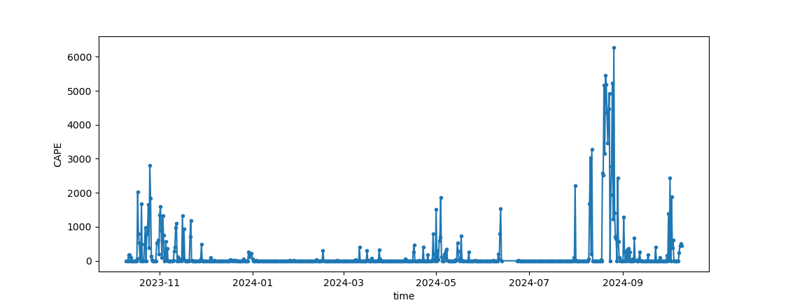

# Will Cloud Seeding work in Qatar?

## What the project is about
We want to understand whether cloud seeding has the potential to increase rainfall in Qatar. This project will use radiosonde data to identify periods where the atmosphere contains sufficient clouds that could be targeted for cloud seeding. You will use a cloud parcel model intiialised with aerosol particles and hygroscopic cloud seeding nuclei to assess whether the hygroscopic nuclei has the potential to increase surface rainfall.

## Code

The code repository for the Bin Microphysics Model is available at [https://github.com/UoM-maul1609/bin-microphysics-model](https://github.com/UoM-maul1609/bin-microphysics-model). This model is written in Fortran and has some associated Python scripts for analysis and plotting.

## Logging in to the virtual machine
Prof. Paul Connolly will start up the VM, give you your username, SSH key (which is a file) and the IP address of the server (VM). To login you need to open `CMD` (on windows), `terminal` if on a mac or Chromebook. You would then type:
   
    ssh -i id_virtual_students.key -X <username>@<IP-address>  

The first time you log in you may need to answer 'yes' to a question about connecting. 


## Downloading the Bin Microphysics Model

Once logged in you will be interacting the VM in the same way as you would a linux server through the terminal. To download the bin microphysics model type:
	
	git clone https://github.com/UoM-maul1609/bin-microphysics-model
	
This should download the code to the folder `bin-microphysics-model`

## Compiling the Bin Microphysics Model

You need to be in the `bin-microphysics-model` folder to compile the code. Type

	cd bin-microphysics-model
	
in the terminal / cmd window to enter the folder.

We need to then tell the computer to build the machine code executable that the computer CPU understands. This can be done by typing:

	make NETCDFLIB=-L/usr/lib/x86_64-linux-gnu/ NETCDFMOD=/usr/include/ FFLAGS='-O2 -w -o' FFLAGS2='-O2 -w -o' FFLAGSOMP='-O2 -w -o'

The `make` command tells the computer to use a file called `Makefile` which is in the `bin-microphysics-model` folder you downloaded. In this file are rules for compiling the code. There are some additional variables that we pass into the Makefile. These are `NETCDFLIB`, `NETCDFMOD`, `FFLAGS`, `FFLAGS2` and `FFLAGSOMP`, which overrides the values they are set to in the Makefile. They need to be altered for our environment. 


## Downloading the Radiosonde data
You will need radiosonde data, which gives the thermodynamic conditions of the atmosphere close to Qatar. The script `download_data_wyoming.py` will automatically download data from the Wyoming database at [https://weather.uwyo.edu/upperair/sounding.html](https://weather.uwyo.edu/upperair/sounding.html). You could download each radiosonde file individually, but that would be very time consuming. The script will download a years worth of data for both 0 and 12 local time. Run the script as follows

	python3 download_data_wyoming.py
	
It will take a while to complete, but will download the data into a folder called `SondeData` in your home folder. You might want to check this folder is empty before you start.

## Reading the Radiosonde data
Once downloaded we can read in all of the radiosonde data using the supplied script `readSondeData.py`. In order to look at the data interactively you will want to run this script from within `ipython3`. If you just pass the script to the python3 interpreter it will read the files and the exit, so all information will be lost. So type the following:

	ipython3
	
Once iPython has started you can run the `readSondeData.py` script as follows:

	run -i readSondeData.py
	
This script will read all of the radiosonde files at ~/SondeData into a python list called `dats`. You can find how many files there are by typing

	len(dats)
	
It probably wont be 2 x number of days in a year because there will be some missing files, which happens when there is a problem with the radiosonde on a particular day. Do not worry about this. 

We generally extract one of these radiosonde ascent files to look at in more detail. Before we do that lets look at some general metrics for the data we have just read in.

## Plotting CAPE vs time

When we read in the radiosondes using `readSondeData.py` it puts the following variables into memory within iPython (you can type `who` or `whos` to see them)
	
	time
	tlcl
	plcl
	cape
	cin
	pw
	
These are: (1) time; (2) temperature of the lifting condensation level; (3) pressure of the lifting condensation level; (4) Convective Available Potential Energy; (5) Convective Inhibition; (6) Precipitable Water. You can then do a plot of CAPE for example as follows

	import matplotlib.pyplot as plt
	plt.ion()
	plt.plot(time,cape,'.-')
	plt.xlabel('time')
	plt.ylabel('CAPE')
	plt.savefig(dataPath.joinpath('cape.png'))

This is just one example, but you could plot other things in a similar way. The data I have downloaded shows that some values of CAPE are 0. These cases are not suitable for analysis. If you would like to download this file you can log in with SSH and then type the following, which will download the file to your local machine.


	get SondeData/cape.png


<p float="left">
  
</p>

*Figure 1. Plot of the CAPE for the radio sonde data we have downloaded.*

## Running the Bin Microphysics Model

You can run the model after it has been compiled by typing

	./run.sh python/namelist-mcb.in

Note that `python/namelist-mcb.in` is the input file for the model, and includes initial values and processes that the model will consider. 

This generates a file called `/tmp/<username>/output1.nc`, which is a so-called NetCDF formatted file containing the model output data. 

## Plotting the output

We can use Python to look at the output. There is an example script at `python/example_plot_bmm.py`. This can be edited to output different variables from the NetCDF file. To plot the output file at `/tmp/<username>/output1.nc` you can type:

	python3 python/example_plot_bmm.py
	
This will generate a file at `/tmp/<username>/Test.png`

## Obtaining the output file
How to we obtain the output file from inside the container, so that we can view it or insert it in a report?

We can open up another `CMD`, or `terminal` window  and connect with SFTP (Secure File Transfer Protocol). 

From another terminal or CMD window type

	sftp -i id_virtual_students.key <username>@<IP-address>
	
This will log you into the VM. You can bring the file over to your local system by typing

	get /tmp/<username>/Test.png
	
And then you will be able to view it in the usual way. By default it will be transferred to the folder that you were in before you logged in with SSH. 

## Look-up table for determining cloud albedo

The first calculations of how NaCl mixing ratio in the air impacts cloud albedo were done by a paper we wrote and published in Phil Trans of the Royal Society. See [https://royalsocietypublishing.org/doi/full/10.1098/rsta.2014.0056](https://royalsocietypublishing.org/doi/full/10.1098/rsta.2014.0056)

The `bin-microphysics-model` does not take NaCl mixing ratio as an input. It takes the aerosol lognormal parameters: $`N_{aer}`$, $`D_{aer}`$, $`\ln\sigma_{aer}`$. Let's say that $`D_{aer}`$ and $`\ln\sigma_{aer}`$ are known. We can calculate $`N_{aer}`$ by dividing by the number weighted average mass of the aerosol. This can be calculated by dividing NaCl mixing ratio by the 3rd [moment of a lognormal](https://en.wikipedia.org/wiki/Log-normal_distribution) with weighting for the mass:

```math
\bar{M}=\frac{\pi}{6}\rho _{NaCl} \exp\left(3\ln D_{aer} + 4.5 \ln ^2\sigma_{aer} \right)
```

You can do a batch run using some python scripts to simulate how increasing NaCl mixing ratio in the air impacts the cloud albedo of the base case.

To run the batch run code use the `batchRunsMCB.py` script, which is in the `python` folder inside the repository. This runs 50 simulations for a range of NaCl mixing ratios, that are logarithmically spaced from $`10^{-14}`$ to $`10^{-4}`$ kg kg$`^{-1}`$. 50 output files will be put in `/tmp/<username>`. To go into the python folder enter:
	
	cd python

Then to run the code to batch process these factors type:

	python3 batchRunsMCB.py

In order to create the lookup table (LUT) we can use the `lutMCB.py` script. From inside the `python` directory, enter this command:

	python3 lutMCB.py
	
This will create a plot in `/tmp/<username>/lut.png`, shown in Fig. 1. Interestingly, we see that increasing the NaCl mixing ratio in the air has a non-linear effect on cloud albedo. Why is this? At the large end the curve tends to an albedo of 1 (i.e. all the visible radiation is reflected to space).


*Figure 1. A plot of the cloud albedo vs the NaCl mixing ratio for the default simulation.*


## How to change the base case

You can either change the `python/namelist-mcb.in` file to have full control, or you can edit some of the variables that are changed in the `runsDefineMCB.py` file. In this file you can edit `winit`, `logSig`, and `Dm`, which are the vertical wind speed in m s$^{-1}$ and the size distribution parameters of the sea salt.

## Plot more than one line on the mixing ratio vs albedo plot

From the `python` directory, open up `ipython3` by typing:

	ipython3
	
Run `batchRunsMCB.py` in the following way
	
	import runsDefineMCB
	import batchRunsMCB
	batchRunsMCB.batchRuns()

You can then run the `lutMCB.py` script by typing:

	run -i lutMCB.py
	
As before this will generate a plot and save it in the `/tmp/<username>/lut.png` file.

<mark style="background-color: #FFFF00">THE STEPS BELOW CAN BE REPEATED</mark>


In a separate SSH window you can edit the `runsDefineMCB.py` file (make sure you are in the `python` folder inside the repository:

	nano -l runsDefineMCB.py
	
You can edit `Dm=20e-9` to see what effect changing the mode diameter has. Once the file is saved go back to the `ipython3` window. You will need to re-import `runsDefineMCB` and `batchRunsMCB`

	import importlib
	importlib.reload(runsDefineMCB)
	importlib.reload(batchRunsMCB)

Check that your value of `Dm` has been altered by typing

	batchRunsMCB.Dm
	
It should be equal to `2e-08` if that's what you changed it to. Rerun the `batchRunsMCB.batchRuns()` method by typing:

	batchRunsMCB.batchRuns()
	
when finished plot the new LUT on the existing figure

	run -i lutMCB.py
	
This will add to the curent plot and overwrite / save it in the `/tmp/<username>/lut.png` file.

</mark>

<mark style="background-color: #FFFF00">END REPEAT SECTION</mark>


You may want to add a legend:

	plt.legend(('$D_m=100\,nm$','$D_m=20\,nm$'))
	plt.savefig('/tmp/mccikpc2/lut.png')

The figure will look as in Fig 2.


*Figure 2. A plot of the cloud albedo vs the NaCl mixing ratio for two different mode diameter sizes. The smaller mode size leads to a higher albedo for lower values of NaCl mixing ratio.*

## Cost-Benefit Analysis

### Energy required for the sprayers

To understand whether implementing MCB will be of benefit we need to assess the cost vs the benefit. The paper by Connolly *et al* (2014) assesses the cost of the different spray techniques. These are roughly as follows

Rayleigh instability:

$`P_w\cong \left(\frac{0.45}{D_m}+3.2\times 10^6 \right)Q `$

Taylor cone-jets:

$`P_w\cong 1.2\times 10^9 Q `$

Supercritical flow:

$`P_w\cong 4\times 10^9 Q `$


Effervescent spraying:

$`P_w\cong 3.4\times 10^8 Q `$

where $`Q`$ is the volume flow rate of water in each case. 

---
### Climate calculation

We want to calculate the average global surface temperature, given the values of greenhouse gasses and the albedo. 

The fraction of the globe that is covered by clouds that can be used for MCB is around $`f=17.5\%`$. We assume that the cloud fraction, $cf=70\%$ does not change.

The albedo of the planet, $A_p$, can be estimated by:

$`A_p=\left(cf-f\right)\times A_{c} + \left(1-\left(cf-f\right)\right) \times A_{clear} + f\times A_{gc}`$

where $A_c$ is the albedo of the clouds unaffected by geoengineering, $A_{clear}$ is the albedo of the clear sky, and $A_{gc}$ is the albedo of the geoengineered clouds. Once we calculate, $A_p$, using $A_{gc}$ from our LUT we can calculate the surface temperature in a way similar to [Levenson, 2011](https://www.sciencedirect.com/science/article/pii/S0273117711000883)

---

### How much water, Q?

NaCl aerosol must fill the atmospheric marine boundary layer, which is typically 1000 m deep. The total volume of air is therefore the fraction, $f$, of the area of earth multiplied by the height of the boundary layer, $h$:

$`Vol_{air} = 4\pi R_e^2 \times f\times h`$

The total mass of NaCl is this volume, multiplied by the density of air, $\rho _{air}$, mutiplied by the NaCl mixing ratio:

$`M_{NaCl} = Vol_{air}\times \rho _{air} \times mr_{NaCl}`$

This aerosol is thought to have a lifetime of $\tau=3$-days in the boundary layer, so in order to achieve a steady state, the rate that NaCl must be put into the atmospheric boundary layer is:

$`Q_{NaCl}=\frac{M_{NaCl} }{\tau }`$

The *salinity* is the mass of salt (kg) divided by the volume of water ($m^3$). It has a value of 35 for sea water. Therefore the volume of sea water that must be pumped into the boundary layer per unit time is:

$`Q_{sea} = \frac{Q_{NaCl}}{35}`$

This can be used to calculate the required power of all of the sprayers.

---

### Cost to society of rise in temperature

The Stern Review (2007) gives some [estimates](https://www.cambridge.org/core/services/aop-cambridge-core/content/view/06CF04AE23902BF0E5DC10358ED37079/9780511817434c7_p161-190_CBO.pdf/economic_modelling_of_climatechange_impacts.pdf) of the cost to society of rising global temperatures. Key messages from this review are:

* 2-3 $^\circ C$ warming results in a 0-3% loss in global GDP
* 5-6 $^\circ C$ warming results in a 5-10% loss in global GDP
* These are lower estimates. If there is an amplification, it may lead to a further 5-7% increase in the cost or 11-14% if non-market impacts are included.
* If we factor in the disporportionate burden of climate change the cost could increase by more than 25%.

Current global GDP is approx. 100 trillion USD

The gradient of percent loss in global GDP to rise in temperature is:

$`\frac{7.5-1.5}{5.5-2.5}=2`$

This means that the intercept is $-3.5\%$

So the a straight line fit to this data is:

$`loss_{GDP} = \left(2\Delta T - 3.5\right)\times 100\times 10^{12} \times \frac{1}{100\%}`$

---
### Cost of ships

[This](https://www.scientificamerican.com/article/albedo-yachts-and-marine-clouds/) article hints that the cost would be between 3.2 and 4.8 billion USD to build the ships. Assume maintenance is 2.5\%  of that each year (a pure guess, can this estimate be improved?)

---

### Cost of energy

You can't argue that the energy for the sprayers will be free, even if it is derived from wave energy. The energy must have a cost. The device to convert wave energy to useful energy for the sprayers needs to be manufactured and maintained, so we can argue there will be a cost of energy per joule. The estimate used is $3.9\times 10^{-8}$ USD per joule. A better estimate may be found.

---

## Running the cost-benefit analysis

You will need to have run the `batchRunsMCB.py` script to generate the files for the LUT. Then change directory so you are in the `mcb_analysis` folder

	cd mcb_analysis
	
You can then edit the script `geoengineering_analysis.py` to choose the spray technology. To do this set `method` on line 66 to one of:

* RAYLEIGH_JET
* TAYLOR_CONE
* SUPERCRITICAL
* EFFERVESCENT

Run the script with:

	python3 geoengineering_analysis.py
	
Each time you run the script, 3 plots will be saved in `/tmp/<username>/`. Examples of the cost-benefit analysis are shown in Figure 3.


<p float="left">
  
   
  
  
</p>

*Figure 3. Plots of the cost-benefit analysis for Rayleigh spraying; Taylor Cones, Supercritical, and Effervescent techniques*
	

## References

1. Connolly P. J.,  McFiggans G. B., Wood R. and  Tsiamis A. 2014Factors determining the most efficient spray distribution for marine cloud brighteningPhil. Trans. R. Soc. A.3722014005620140056
http://doi.org/10.1098/rsta.2014.0056

2. Levenson B. P., Planet temperatures with surface cooling parameterized, Advances in Space Research, Volume 47, Issue 11, 2011, Pages 2044-2048, ISSN 0273-1177,
https://doi.org/10.1016/j.asr.2011.01.031

3. Stern, N. (2007). Economic Modelling of Climate-Change Impacts. In The Economics of Climate Change: The Stern Review (pp. 161-190). Cambridge: Cambridge University Press. doi:10.1017/CBO9780511817434.012

4. Latham, J., Bower, K., Choularton, T., Coe, H., Connolly, P., Cooper, G., Craft, T., Foster, J., Gadian, A., Galbraith, L., Iacovides, H., Johnston, D., Launder, B., Leslie, B., Meyer, J., Neukermans, A., Ormond, B., Parkes, B., Rasch, P., Rush, J., Salter, S., Stevenson, T., Wang, H., Wang, Q., Wood, R., 2012. Marine cloud brightening. Philos. Trans. A. Math. Phys. Eng. Sci. 370, 4217–62. https://doi.org/10.1098/rsta.2012.0086