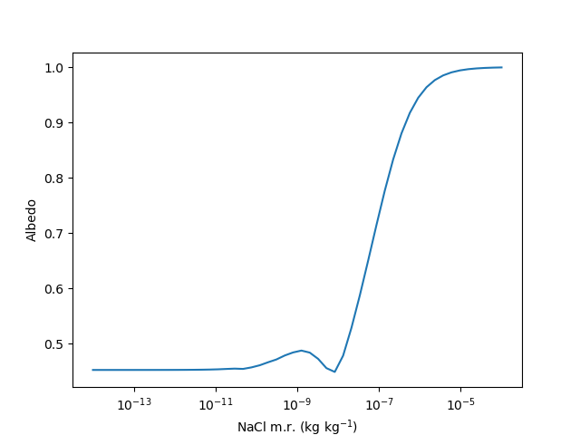
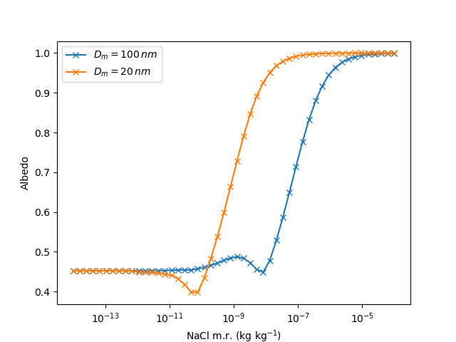

# Cost-Benefit Analysis of Marine Cloud Brightening

The code repository for the Bin Microphysics Model is available at [https://github.com/UoM-maul1609/bin-microphysics-model](https://github.com/UoM-maul1609/bin-microphysics-model). This model is written in Fortran and has some associated Python scripts for analysis and plotting.

## Logging in to the virtual machine
Prof. Paul Connolly will start up the VM, give you your username, SSH key (which is a file) and the IP address of the server (VM). To login you need to open `CMD` (on windows), `terminal` if on a mac or Chromebook. You would then type:
   
    ssh -i id_virtual_students.key -X <username>@<IP-address>  

The first time you log in you may need to answer 'yes' to a question about connecting. 


## Downloading the Bin Microphysics Model

Once logged in you will be interacting the VM in the same way as you would a linux server through the terminal. To download the bin microphysics model type:
	
	git clone https://github.com/UoM-maul1609/bin-microphysics-model
	
This should download the code to the folder `bin-microphysics-model`

## Compiling the Bin Microphysics Model

You need to be in the `bin-microphysics-model` folder to compile the code. Type

	cd bin-microphysics-model
	
in the terminal / cmd window to enter the folder.

We need to then tell the computer to build the machine code executable that the computer CPU understands. This can be done by typing:

	make NETCDFLIB=-L/usr/lib/x86_64-linux-gnu/ NETCDFMOD=/usr/include/ FFLAGS='-O2 -w -o' FFLAGS2='-O2 -w -o' FFLAGSOMP='-O2 -w -o'

The `make` command tells the computer to use a file called `Makefile` which is in the `bin-microphysics-model` folder you downloaded. In this file are rules for compiling the code. There are some additional variables that we pass into the Makefile. These are `NETCDFLIB`, `NETCDFMOD`, `FFLAGS`, `FFLAGS2` and `FFLAGSOMP`, which overrides the values they are set to in the Makefile. They need to be altered for our environment. 

## Running the Bin Microphysics Model

You can run the model after it has been compiled by typing

	./run.sh python/namelist-mcb.in

Note that `python/namelist-mcb.in` is the input file for the model, and includes initial values and processes that the model will consider. 

This generates a file called `/tmp/<username>/output1.nc`, which is a so-called NetCDF formatted file containing the model output data. 

## Plotting the output

We can use Python to look at the output. There is an example script at `python/example_plot_bmm.py`. This can be edited to output different variables from the NetCDF file. To plot the output file at `/tmp/<username>/output1.nc` you can type:

	python3 python/example_plot_bmm.py
	
This will generate a file at `/tmp/<username>/Test.png`

## Obtaining the output file
How to we obtain the output file from inside the container, so that we can view it or insert it in a report?

We can open up another `CMD`, or `terminal` window  and connect with SFTP (Secure File Transfer Protocol). 

From another terminal or CMD window type

	sftp -i id_virtual_students.key <username>@<IP-address>
	
This will log you into the VM. You can bring the file over to your local system by typing

	get /tmp/<username>/Test.png
	
And then you will be able to view it in the usual way. By default it will be transferred to the folder that you were in before you logged in with SSH. 

## Look-up table for determining cloud albedo

The first calculations of how NaCl mixing ratio in the air impacts cloud albedo were done by a paper we wrote and published in Phil Trans of the Royal Society. See [https://royalsocietypublishing.org/doi/full/10.1098/rsta.2014.0056](https://royalsocietypublishing.org/doi/full/10.1098/rsta.2014.0056)

The `bin-microphysics-model` does not take NaCl mixing ratio as an input. It takes the aerosol lognormal parameters: $`N_{aer}`$, $`D_{aer}`$, $`\ln\sigma_{aer}`$. Let's say that $`D_{aer}`$ and $`\ln\sigma_{aer}`$ are known. We can calculate $`N_{aer}`$ by dividing by the number weighted average mass of the aerosol. This can be calculated by dividing NaCl mixing ratio by the 3rd [moment of a lognormal](https://en.wikipedia.org/wiki/Log-normal_distribution) with weighting for the mass:

```math
\frac{\pi}{6}\rho _{NaCl} \exp\left(3\ln D_{aer} + 4.5 \ln ^2\sigma_{aer} \right)
```

You can do a batch run using some python scripts to simulate how increasing NaCl mixing ratio in the air impacts the cloud albedo of the base case.

To run the batch run code use the `batchRunsMCB.py` script, which is in the `python` folder inside the repository. This runs 50 simulations for a range of NaCl mixing ratios, that are logarithmically spaced from $`10^-14`$ to $`10^{-4}`$ kg kg$`^{-1}`$. 50 output files will be put in `/tmp/<username>`. To go into the python folder enter:
	
	cd python

Then to run the code to batch process these factors type:

	python3 batchRunsMCB.py

In order to create the lookup table (LUT) we can use the `lutMCB.py` script. From inside the `python` directory, enter this command:

	python3 lutMCB.py
	
This will create a plot in `/tmp/<username>/lut.png`, shown in Fig. 1. Interestingly, we see that increasing the NaCl mixing ratio in the air has a non-linear effect on cloud albedo. Why is this? At the large end the curve tends to an albedo of 1 (i.e. all the visible radiation is reflected to space).



*Figure 1. A plot of the cloud albedo vs the NaCl mixing ratio for the default simulation.*


## How to change the base case

You can either change the `python/namelist-mcb.in` file to have full control, or you can edit some of the variables that are changed in the `runsDefineMCB.py` file. In this file you can edit `winit`, `logSig`, and `Dm`, which are the vertical wind speed in m s$^{-1}$ and the size distribution parameters of the sea salt.

## Plot more than one line on the mixing ratio vs albedo plot

From the `python` directory, open up `ipython3` by typing:

	ipython3
	
Run `batchRunsMCB.py` in the following way
	
	import runsDefineMCB
	import batchRunsMCB
	batchRunsMCB.batchRuns()

You can then run the `lutMCB.py` script by typing:

	run -i lutMCB.py
	
As before this will generate a plot and save it in the `/tmp/<username>/lut.png` file.

<mark style="background-color: #FFFF00">THE STEPS BELOW CAN BE REPEATED</mark>


In a separate SSH window you can edit the `runsDefineMCB.py` file (make sure you are in the `python` folder inside the repository:

	nano -l runsDefineMCB.py
	
You can edit `Dm=20e-9` to see what effect changing the mode diameter has. Once the file is saved go back to the `ipython3` window. You will need to re-import `runsDefineMCB` and `batchRunsMCB`

	import importlib
	importlib.reload(runsDefineMCB)
	importlib.reload(batchRunsMCB)

Check that your value of `Dm` has been altered by typing

	batchRunsMCB.Dm
	
It should be equal to `2e-08` if that's what you changed it to. Rerun the `batchRunsMCB.batchRuns()` method by typing:

	batchRunsMCB.batchRuns()
	
when finished plot the new LUT on the existing figure

	run -i lutMCB.py
	
This will add to the curent plot and overwrite / save it in the `/tmp/<username>/lut.png` file.

</mark>

<mark style="background-color: #FFFF00">END REPEAT SECTION</mark>


You may want to add a legend:

	plt.legend(('$D_m=100\,nm$','$D_m=20\,nm$'))
	plt.savefig('/tmp/mccikpc2/lut.png')

The figure will look as in Fig 2.



*Figure 2. A plot of the cloud albedo vs the NaCl mixing ratio for two different mode diameter sizes. The smaller mode size leads to a higher albedo for lower values of NaCl mixing ratio.*

## References

1. Connolly P. J.,  McFiggans G. B., Wood R. and  Tsiamis A. 2014Factors determining the most efficient spray distribution for marine cloud brighteningPhil. Trans. R. Soc. A.3722014005620140056
http://doi.org/10.1098/rsta.2014.0056