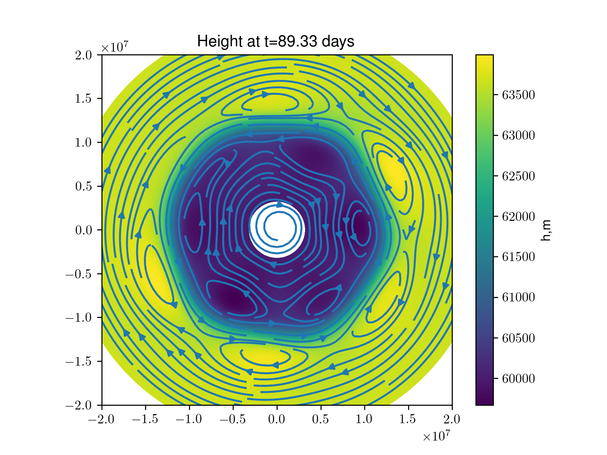
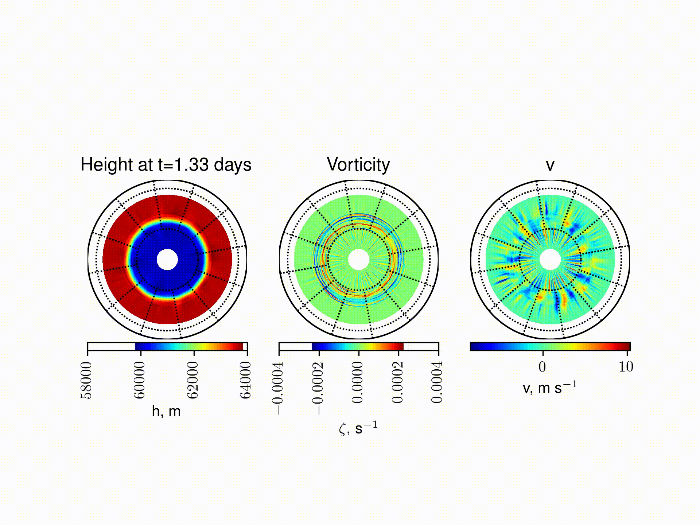
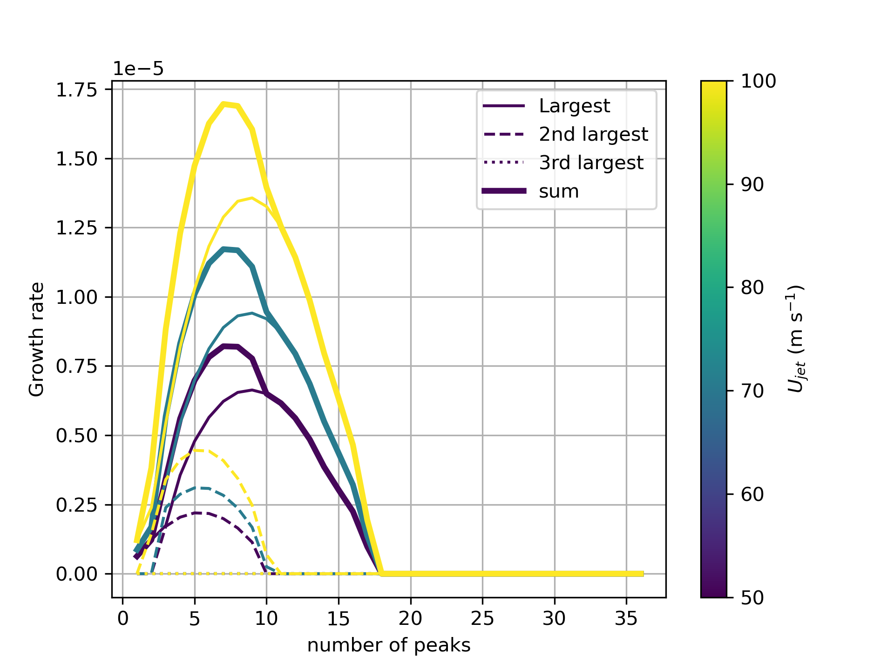
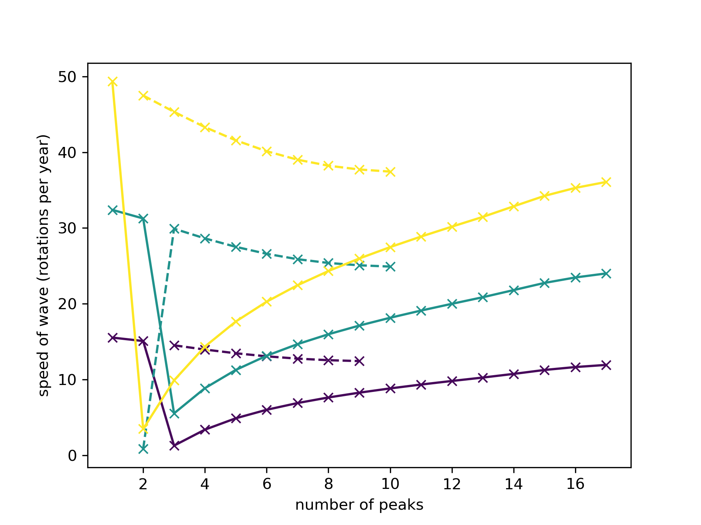
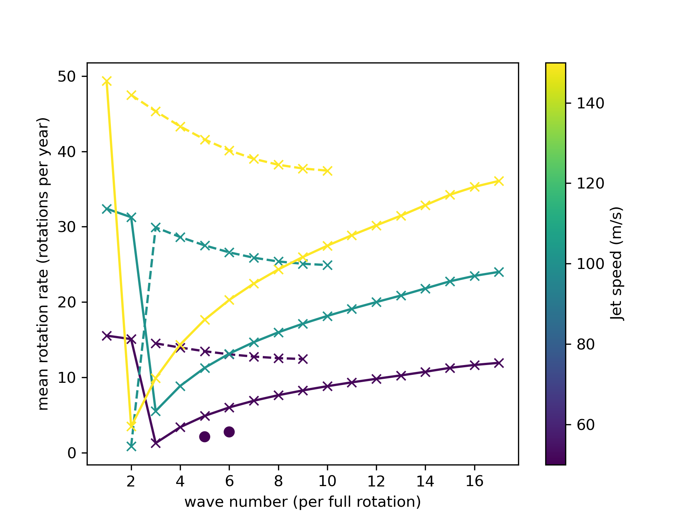
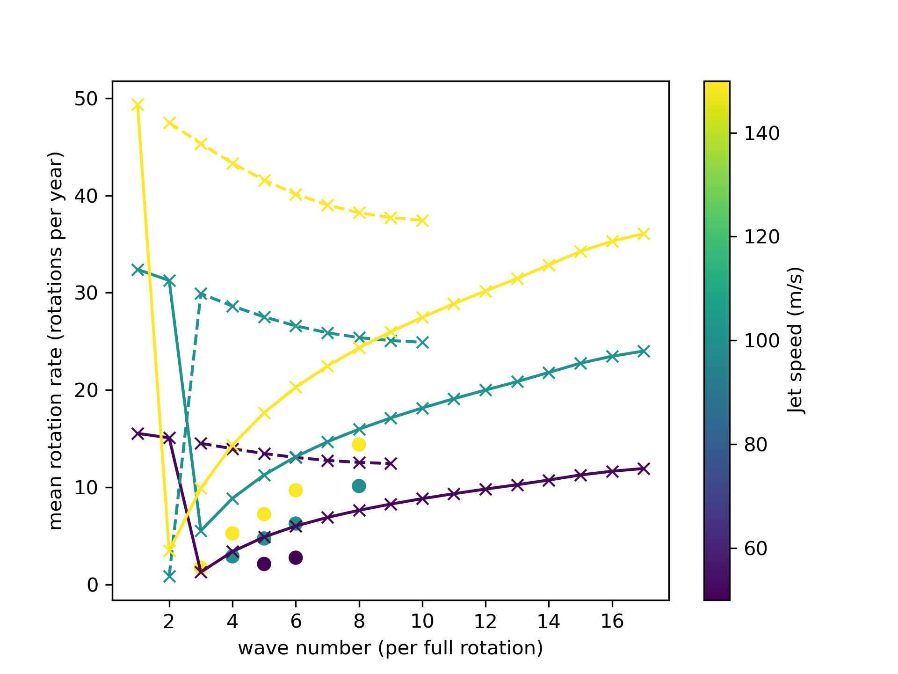
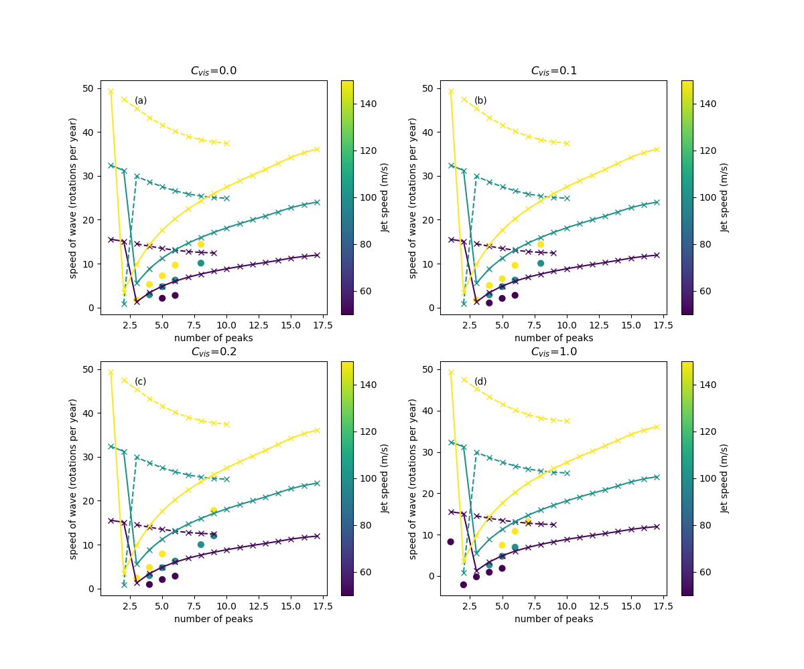

# Saturn's Hexagon

## What the project is about

In the 80s the Voyager missions delivered images of a hexagonal structure around the north pole of Saturn. Striking optical images were later delivered by the Cassini mission in the 2010s. This structure was later revealed to be a Rossby wave in the atmosphere of Saturn. But how and why does it form? This will be the topic of this project. To answer this question you will use a shallow-water model mapped on to a sphere and perform numerical simulations of an atmospheric jet in the northern hemisphere of Saturn. You will experiment with different jet speeds, and thicknesses in addition to other variables. Depending on your interests you may also experiment with linear wave theory to understand why there are 6-sides to the Rossby wave and delve into why the Rossby wave moves as it does. 

## Code
The code repository for the Shallow Water Model on Sphere is available at [https://github.com/UoM-maul1609/shallow-water-model-on-sphere](https://github.com/UoM-maul1609/shallow-water-model-on-sphere). This model is written in Fortran and has some associated Python scripts for analysis and plotting.

## Logging in to the virtual machine
Prof. Paul Connolly will start up the VM, give you your username, SSH key (which is a file) and the IP address of the server (VM). To login you need to open `CMD` (on windows), `terminal` if on a mac or Chromebook. You would then type:
   
    ssh -i id_virtual_students.key -X <username>@<IP-address>  

The first time you log in you may need to answer 'yes' to a question about connecting. 

## Downloading the Shallow Water Model

Once logged in you will be interacting the VM in the same way as you would a linux server through the terminal. To download the shallow water model type:
	
	git clone https://github.com/UoM-maul1609/shallow-water-model-on-sphere
	
This should download the code to the folder `shallow-water-model-on-sphere`

## Compiling the Shallow Water Model

You need to be in the `shallow-water-model-on-sphere` folder to compile the code. Type

	cd shallow-water-model-on-sphere
	
in the terminal / cmd window to enter the folder.

We need to then tell the computer to build the machine code executable that the computer CPU understands. This can be done by typing:

	make NETCDFLIB=-L/usr/lib/x86_64-linux-gnu/ NETCDFMOD=/usr/include/ FFLAGS='-O2 -w -o' FFLAGS2='-O2 -w -o' FFLAGSOMP='-O2 -w -o'

The `make` command tells the computer to use a file called `Makefile` which is in the `shallow-water-model-on-sphere` folder you downloaded. In this file are rules for compiling the code. There are some additional variables that we pass into the Makefile. These are `NETCDFLIB`, `NETCDFMOD`, `FFLAGS`, `FFLAGS2` and `FFLAGSOMP`, which overrides the values they are set to in the Makefile. They need to be altered for our environment. 

## Running the Shallow Water Model

You can run the model on 4 processors after it has been compiled by typing

	./run.sh 4

Note that `namelist.in` is the input file for the model, and includes initial values and processes that the model will consider. 

This generates a file called `/tmp/<username>/output.nc`, which is a so-called NetCDF formatted file containing the model output data. 

## Plotting the output
### Basic plotting of the output
Once a model simulation is done and saved in `/tmp/<username>/output.nc` you can create a plot of the last output of the height field by typing:

	python3 python/height_and_streamlines.py
	
This will create a plot `/tmp/<username>/frame.png`, like the plot in Fig 1.

*Figure 1. A plot of the model height field with streamlines overlaid. Height is a proxy for pressure in the shallow water model. Note the counter-rotating vortices either side of the jet. X and Y coordinate are in metres.*

You can create an animated gif of the model output in `/tmp/<username>/output.nc` by typing:

	python3 python/animate_output.py
	
This will create an animation `/tmp/<username>/animation.gif`, like the plot in Fig 2.

 
 

*Figure 2. An animation of the height field (left); the relative vorticity (middle) and the v-wind (right) over the course of one simulation.*

---

### Track the wavenumber and calculate the rotation rate

This is done with the script `python/fourier_wave_number.py`. It will find the numbers of peaks and troughs in the wave, and the phase of the wave for the model simulation at `/tmp/<username>/output.nc`. It will then plot the wave number against the gradient of the phase in units of rotations per year. The output file is saved at `/tmp/<username>/fourier_wave_number.png`. Run the script by typing

	python3 python/fourier_wave_number.py

---

### Linear Theory Analysis

The text book by [Mankin Mak (2012)](https://www-cambridge-org.manchester.idm.oclc.org/core/books/atmospheric-dynamics/D812C816F3F4F580C3448731D7857F5D) gives details of linear growth theory for an idealised jet. This has been coded in python in the file `python/normal_modes_compare.py`. Look to see which values of `u_jets` the calculations are done for and the value of `h_jet`. These can be changed, the file saved and it re-run. To run this analysis type:

	python3 python/normal_modes_compare.py 2
	
The file produced is called `/tmp/<username>/fourier_wave_number.png` and is shown in Fig 3. 

*Figure 3. Normal mode analysis for different u_jet values. The thin solid lines are the modes with the largest growth rate at a particular wavenumber value. The one with the highest peak is said to be the dominant mode. However, the dashed-lines are the next most dominant mode and the dotted lines the 3rd most (they are too small to be visible). The thick solid line is a sum of all modes. We see in all cases that the sum has a different wavenumber at the peak than the most dominant.*

Each value of the growth rate has a corresponding wave speed, as explained in the book by [Mankin Mak (2012)](https://www-cambridge-org.manchester.idm.oclc.org/core/books/atmospheric-dynamics/D812C816F3F4F580C3448731D7857F5D). This can be plotted by using the save script, but typing:

	python3 python/normal_modes_compare.py 1
	
The file produced is called `/tmp/<username>/fourier_wave_number.png` and is shown in Fig 4. 

*Figure 4. Normal mode analysis for different u_jet values. In this plot the solid lines are the relationship between number of peaks in the wave and the wave speed / rotation rate for the most dominant mode. The dashed lines are for the second most dominant. 3 values of u_jet are shown: 50, 100 and 150 m s$^{-1}$. Blue is 50, turquose is 100 and yellow is 150.*

<!--

  
   
  
  

-->

---

### Comparing the model to Linear Theory

You can run a set of simulations in batch mode. Look at the file `batch_runs.sh`. By default this is set up to run simulations for different values of `u_jet` and `c_vis`. You can run by typing

	./batch_runs.sh 4
	
The 4 is the number of processors. If you want to set this off and come back later you can type:

	nohup ./batch_runs.sh 4 &
	
Check your runs are working by checking `htop` (you can press 'q' to quite from `htop`). The runs will be created in `/tmp/<username>` and will be named as different runs depending on which simulation was done. 

To plot these simulations you can run the `python/animate_batch.py` script (although `u_jet` and `c_vis` need to be set to the same values you used in the `batch_runs.sh` script and the file saved).

	python3 python/animate_batch.py

This will make an animated gif in `/tmp/<username>/animation_batch.gif`, like in Fig. 5. 

*Figure 5. Animated gif of the relative vorticity for different values of u_jet and c_vis. You can see that the slower jets tend to result in higher polygon edge counts. Also the number of edges starts high and gets lower towards the end in some cases.*

To compare the batch runs to the linear analysis you can use the script `python/analyse_output.py`. Again `u_jet` and `c_vis` need to be set to the same values you used in the `batch_runs.sh` script. You may need to edit and save this file. Run the script by typing:

	python3 python/analyse_output.py
	
This script will call `fourier_wave_number.py` and `normal_modes_compare.py`. `fourier_wave_number.py` calculates from the model output the number of peaks and troughs in the Rossby wave and the rotation speed. These are compared to the normal mode analysis. We choose the most dominant mode at a particular wave number and use the corresponding rotation rate (from the linear analysis) to compare with the model. The file produced is called `/tmp/<username>/full_analysis.png` and an example shown in Fig. 6. 
 

*Figure 6. Comparison of normal mode theory with model output for different `c_vis` and `u_jet`. In general the rotation rate is slower in the model than in the linear analysis*

## Obtaining the output file
How to we obtain the output file from inside the container, so that we can view it or insert it in a report?

We can open up another `CMD`, or `terminal` window  and connect with SFTP (Secure File Transfer Protocol). 

From another terminal or CMD window type

	sftp -i id_virtual_students.key <username>@<IP-address>
	
This will log you into the VM. You can bring any of the files over to your local system by typing (e.g.)

	get /tmp/<username>/<filename>
	
And then you will be able to view it in the usual way. By default it will be transferred to the folder that you were in before you logged in with SSH. 

## References

1. Ana C. Barbosa Aguiar, Peter L. Read, Robin D. Wordsworth, Tara Salter, Y. Hiro Yamazaki, A laboratory model of Saturn’s North Polar Hexagon, Icarus, Volume 206, Issue 2,
2010, Pages 755-763,
https://doi.org/10.1016/j.icarus.2009.10.022.
2. Mak, M. (2011). Atmospheric Dynamics. Cambridge: Cambridge University Press. (pp 229-235) doi:10.1017/CBO9780511762031